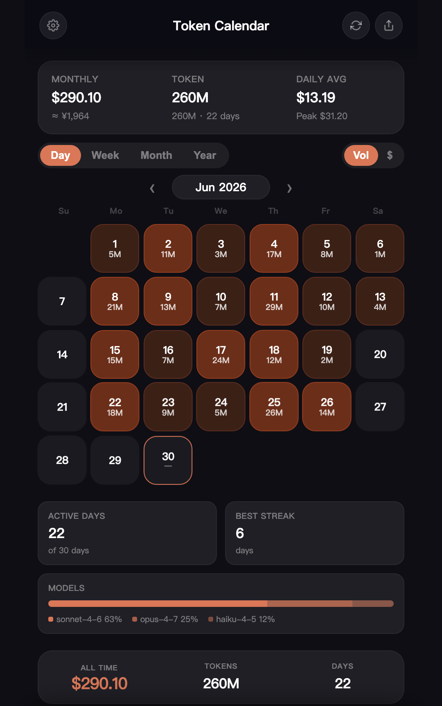
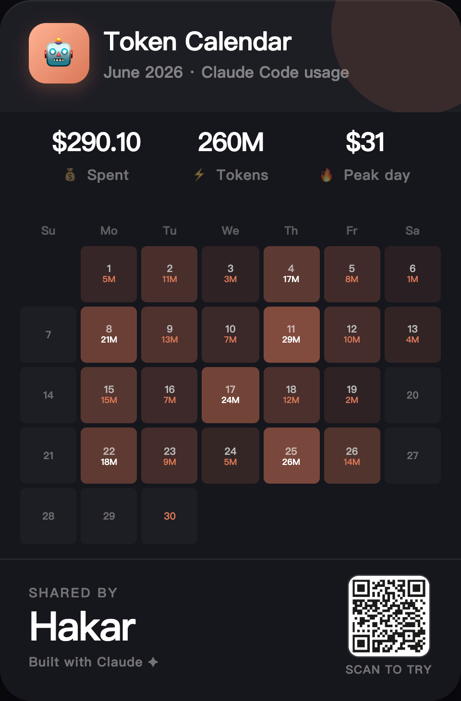

# Token Calendar

A calendar heatmap for your **AI coding token spend**. See how much you burn each day at a glance — works with **Claude Code, Codex, Gemini CLI, or any tool** that exports usage. Import a CSV or JSON and you're done.

**One single HTML file. No backend. No tracking. Your data never leaves the browser.**

🔗 **[Live demo →](https://yifanliu734-coder.github.io/token-calendar/)**

## Why

I kept losing track of how much I was spending on AI coding agents. The console shows you a number, but not the *shape* of your usage — which days you went heavy, when costs spiked, which models ate the budget. So I built a GitHub-contributions-style heatmap for it. It's tool-agnostic: any usage export with a date, a token count, and a cost works.

## Features

- 📅 **Calendar heatmap** — daily token volume or cost, color-graded so spikes jump out
- 📊 **Day / Week / Month / Year** views with totals, daily average, peak day, longest streak
- 🤖 **Per-model breakdown** — see which models drove each day's spend
- 🧩 **Tool-agnostic import** — Claude Code / Anthropic Console CSV, Codex / OpenAI usage, plain JSON, or a 3-column CSV (`date,tokens,cost`)
- 🌐 **9 languages built in** — English, 中文, 日本語, 한국어, Español, Français, Deutsch, Português, Русский
- 🌗 **Dark / light + accent color** themes
- 🖼️ **Share poster** — export a clean image of your month
- 🔒 **100% local** — everything lives in `localStorage`, nothing is uploaded

## Usage

**Option A — just open it**
Download `index.html` and double-click. That's it.

**Option B — use the hosted version**
Go to the [live demo](https://yifanliu734-coder.github.io/token-calendar/).

**Import your real data**
1. Export your usage as CSV or JSON:
   - **Claude Code / Anthropic** → Console → Usage → export CSV
   - **Codex / OpenAI** → usage export (or any CSV with date + tokens + cost)
   - **Any other tool** → a 3-column CSV: `date,tokens,cost`
2. In Token Calendar, tap the import button
3. Drop the file (or paste JSON / CSV) → Merge

The importer auto-detects columns — it looks for a `date`, a token count (or separate `input`/`output` token columns), an optional `cost`, and an optional `model`. The demo data is fake — clear it and import your own to see real numbers.

## Share your month

Tap the share button to export a poster of your month — with a QR code linking back to the tool.

## Tech

Vanilla HTML/CSS/JS in a single file. No build step, no dependencies, no server. Roughly 1,800 lines you can read top to bottom.

## License

MIT — do whatever you want.

---

Built with [Claude Code](https://claude.com/claude-code). If this is useful, a ⭐ helps.
